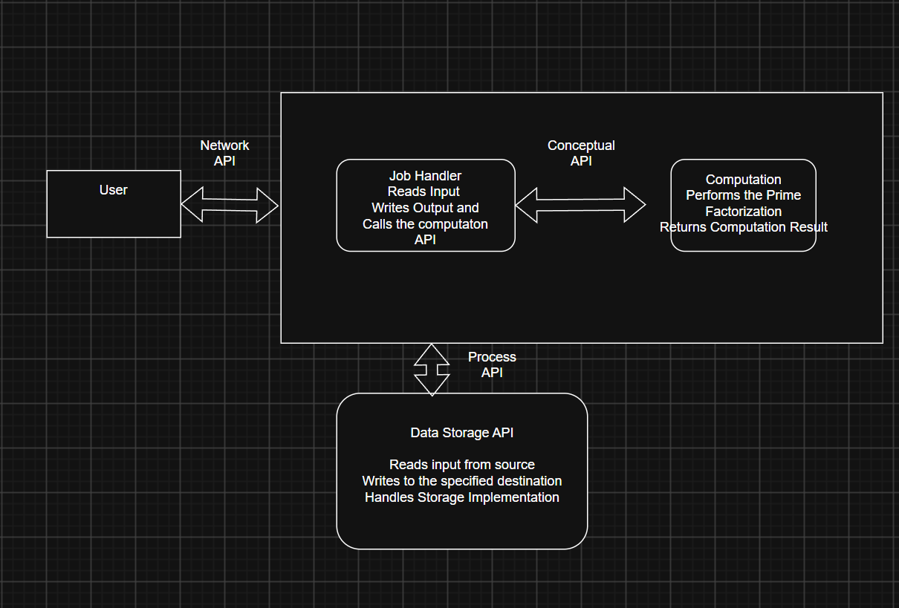

# Prime Factor Finder

This system will perform prime factorization.

For each positive integer, the system finds all of its prime factors. Repeated factors are included when a prime divides the input more than once.

For example:

Input: 84
Output: 2, 2, 3, 7

Another example:

Input: 100
Output: 2, 2, 5, 5

Prime factorization was selected because larger integers require substantially more computation than simple arithmetic operations. 
